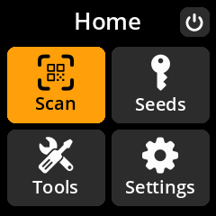
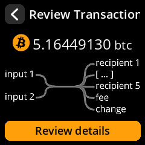
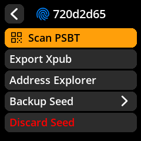
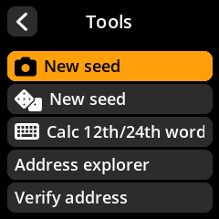

# SeedSigner Screenshots 

SeedSigner screenshots can be freely used in any tutorial, article, video, etc. As a courtesy, please link back to this repo or the SeedSigner website in your attribution.

 

 

## Generating screenshots
The screenshot generator is integrated into the SeedSigner test suite and requires a local copy of the SeedSigner repo with the test suite dependencies installed.

see: https://github.com/SeedSigner/seedsigner/blob/dev/tests/screenshot_generator/README.md

## Currently supported or in-progress languages
* [English](en/README.md)
* [Català](ca/README.md)
* [Deutsch](de/README.md)
* [Español](es/README.md)
* [Français](fr/README.md)
* [Italiano](it/README.md)
* [Nederlands](nl/README.md)
* [(beta) 简体中文 (Chinese Simplified)](zh_Hans_CN/README.md)
* [(beta) 日本語 (Japanese)](ja/README.md)
