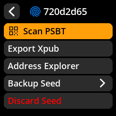

# SeedSigner Screenshots 

SeedSigner screenshots can be freely used in any tutorial, article, video, etc. As a courtesy, please link back to this repo or the SeedSigner website in your attribution.

See the full collection: [v0.7.0 screenshots](en/README.md)

 

 

## Generating screenshots
The screenshot generator is integrated into the SeedSigner test suite and requires a local copy of the SeedSigner repo with the test suite dependencies installed.

see: https://github.com/SeedSigner/seedsigner/blob/dev/tests/screenshot_generator/README.md

---

## In-progress multilanguage support
_This repo also contains screenshots from earlier multilanguage implementation efforts that are now out of date. Multilanguage support has not been abandoned, just pushed back multiple times with no definitive release date planned yet._

* [Arabic](ar/README.md)
* [Czech](cs/README.md)
* [English](en/README.md)
* [French](fr/README.md)
* [German](de/README.md)
* [Hebrew](he/README.md)
* [Japanese](ja/README.md)
* [Korean](kr/README.md)
* [Portuguese](pt/README.md)
* [Russian](ru/README.md)
* [Spanish](es/README.md)
