# SeedSigner Screenshots: German
## Translation progress: 100.0%

---

---

## Main Menu Views

<table style="border: 0;"><tr><td align="center"><table align="left" style="border: 1px solid gray;"><tr><td align="center">MainMenuView  </td></tr></table><table align="left" style="border: 1px solid gray;"><tr><td align="center">PowerOffView  </td></tr></table><table align="left" style="border: 1px solid gray;"><tr><td align="center">SettingsUpdatedView  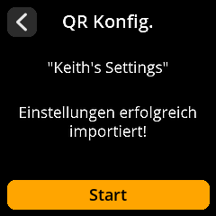</td></tr></table></td></tr></table>

---

## Seed Views

<table style="border: 0;"><tr><td align="center"><table align="left" style="border: 1px solid gray;"><tr><td align="center">SeedsMenuView  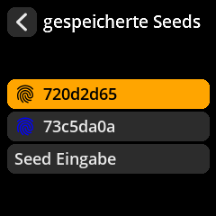</td></tr></table><table align="left" style="border: 1px solid gray;"><tr><td align="center">LoadSeedView  </td></tr></table><table align="left" style="border: 1px solid gray;"><tr><td align="center">SeedMnemonicEntryView  </td></tr></table><table align="left" style="border: 1px solid gray;"><tr><td align="center">SeedMnemonicInvalidView  </td></tr></table><table align="left" style="border: 1px solid gray;"><tr><td align="center">SeedOptionsView  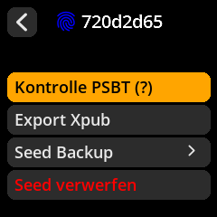</td></tr></table><table align="left" style="border: 1px solid gray;"><tr><td align="center">SeedBackupView  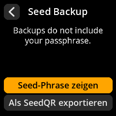</td></tr></table><table align="left" style="border: 1px solid gray;"><tr><td align="center">SeedWordsWarningView  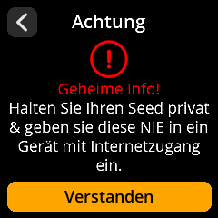</td></tr></table><table align="left" style="border: 1px solid gray;"><tr><td align="center">SeedWordsView  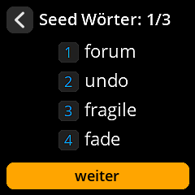</td></tr></table><table align="left" style="border: 1px solid gray;"><tr><td align="center">SeedWordsView_2  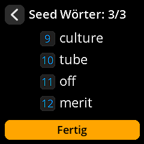</td></tr></table><table align="left" style="border: 1px solid gray;"><tr><td align="center">SeedTranscribeSeedQRFormatView  </td></tr></table><table align="left" style="border: 1px solid gray;"><tr><td align="center">SeedTranscribeSeedQRWarningView  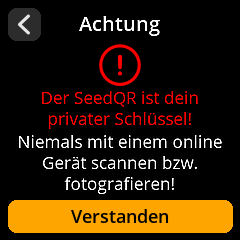</td></tr></table><table align="left" style="border: 1px solid gray;"><tr><td align="center">SeedTranscribeSeedQRWholeQRView_12_Standard  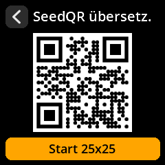</td></tr></table><table align="left" style="border: 1px solid gray;"><tr><td align="center">SeedTranscribeSeedQRWholeQRView_12_Compact  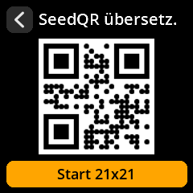</td></tr></table><table align="left" style="border: 1px solid gray;"><tr><td align="center">SeedTranscribeSeedQRConfirmQRPromptView  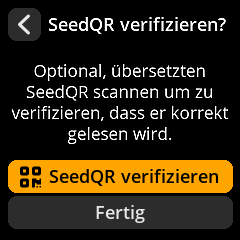</td></tr></table></td></tr></table>

---

## Tools Views

<table style="border: 0;"><tr><td align="center"><table align="left" style="border: 1px solid gray;"><tr><td align="center">ToolsMenuView  </td></tr></table><table align="left" style="border: 1px solid gray;"><tr><td align="center">ToolsDiceEntropyMnemonicLengthView  </td></tr></table><table align="left" style="border: 1px solid gray;"><tr><td align="center">ToolsDiceEntropyEntryView  </td></tr></table></td></tr></table>

---

## Settings Views

<table style="border: 0;"><tr><td align="center"><table align="left" style="border: 1px solid gray;"><tr><td align="center">SettingsMenuView  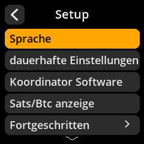</td></tr></table><table align="left" style="border: 1px solid gray;"><tr><td align="center">SettingsEntryUpdateSelectionView_locale  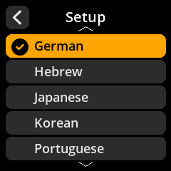</td></tr></table><table align="left" style="border: 1px solid gray;"><tr><td align="center">SettingsEntryUpdateSelectionView_persistent_settings  </td></tr></table><table align="left" style="border: 1px solid gray;"><tr><td align="center">SettingsEntryUpdateSelectionView_coordinators  </td></tr></table><table align="left" style="border: 1px solid gray;"><tr><td align="center">SettingsEntryUpdateSelectionView_denomination  </td></tr></table><table align="left" style="border: 1px solid gray;"><tr><td align="center">SettingsEntryUpdateSelectionView_network  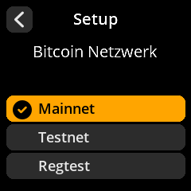</td></tr></table><table align="left" style="border: 1px solid gray;"><tr><td align="center">SettingsEntryUpdateSelectionView_qr_density  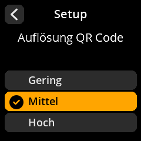</td></tr></table><table align="left" style="border: 1px solid gray;"><tr><td align="center">SettingsEntryUpdateSelectionView_xpub_export  </td></tr></table><table align="left" style="border: 1px solid gray;"><tr><td align="center">SettingsEntryUpdateSelectionView_sig_types  </td></tr></table><table align="left" style="border: 1px solid gray;"><tr><td align="center">SettingsEntryUpdateSelectionView_script_types  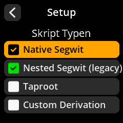</td></tr></table><table align="left" style="border: 1px solid gray;"><tr><td align="center">SettingsEntryUpdateSelectionView_xpub_details  </td></tr></table><table align="left" style="border: 1px solid gray;"><tr><td align="center">SettingsEntryUpdateSelectionView_passphrase  </td></tr></table><table align="left" style="border: 1px solid gray;"><tr><td align="center">SettingsEntryUpdateSelectionView_camera_rotation  </td></tr></table><table align="left" style="border: 1px solid gray;"><tr><td align="center">SettingsEntryUpdateSelectionView_compact_seedqr  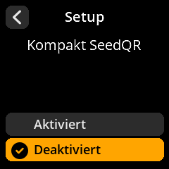</td></tr></table><table align="left" style="border: 1px solid gray;"><tr><td align="center">SettingsEntryUpdateSelectionView_privacy_warnings  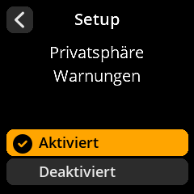</td></tr></table><table align="left" style="border: 1px solid gray;"><tr><td align="center">SettingsEntryUpdateSelectionView_dire_warnings  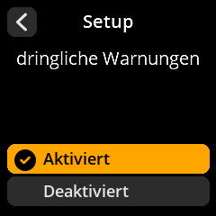</td></tr></table><table align="left" style="border: 1px solid gray;"><tr><td align="center">SettingsEntryUpdateSelectionView_partner_logos  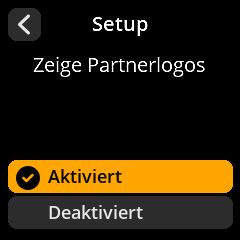</td></tr></table><table align="left" style="border: 1px solid gray;"><tr><td align="center">IOTestView  </td></tr></table><table align="left" style="border: 1px solid gray;"><tr><td align="center">DonateView  </td></tr></table></td></tr></table>