# SeedSigner Screenshots

---

## Main Menu Views

<table style="border: 0;"><tr><td align="center">
  <table align="left" style="border: 1px solid gray;"><tr><td align="center">MainMenuView  </td></tr></table>
  <table align="left" style="border: 1px solid gray;"><tr><td align="center">MainMenuView_SDCardStateChangeToast_removed  </td></tr></table>
  <table align="left" style="border: 1px solid gray;"><tr><td align="center">MainMenuView_SDCardStateChangeToast_inserted  </td></tr></table>
  <table align="left" style="border: 1px solid gray;"><tr><td align="center">MainMenuView_RemoveSDCardToast  </td></tr></table>
  <table align="left" style="border: 1px solid gray;"><tr><td align="center">PowerOptionsView  </td></tr></table>
  <table align="left" style="border: 1px solid gray;"><tr><td align="center">RestartView  </td></tr></table>
  <table align="left" style="border: 1px solid gray;"><tr><td align="center">PowerOffView  </td></tr></table>
  <table align="left" style="border: 1px solid gray;"><tr><td align="center">NotYetImplementedView  </td></tr></table>
  <table align="left" style="border: 1px solid gray;"><tr><td align="center">UnhandledExceptionView  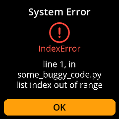</td></tr></table>
  <table align="left" style="border: 1px solid gray;"><tr><td align="center">SettingsIngestSettingsQRView  </td></tr></table>
  <table align="left" style="border: 1px solid gray;"><tr><td align="center">NetworkMismatchErrorView  </td></tr></table>
</td></tr></table>

---

## Seed Views

<table style="border: 0;"><tr><td align="center">
  <table align="left" style="border: 1px solid gray;"><tr><td align="center">SeedsMenuView  </td></tr></table>
  <table align="left" style="border: 1px solid gray;"><tr><td align="center">LoadSeedView  </td></tr></table>
  <table align="left" style="border: 1px solid gray;"><tr><td align="center">SeedMnemonicEntryView  </td></tr></table>
  <table align="left" style="border: 1px solid gray;"><tr><td align="center">SeedMnemonicInvalidView  </td></tr></table>
  <table align="left" style="border: 1px solid gray;"><tr><td align="center">SeedFinalizeView  </td></tr></table>
  <table align="left" style="border: 1px solid gray;"><tr><td align="center">SeedAddPassphraseView  </td></tr></table>
  <table align="left" style="border: 1px solid gray;"><tr><td align="center">SeedReviewPassphraseView  </td></tr></table>
  <table align="left" style="border: 1px solid gray;"><tr><td align="center">SeedOptionsView  </td></tr></table>
  <table align="left" style="border: 1px solid gray;"><tr><td align="center">SeedBackupView  </td></tr></table>
  <table align="left" style="border: 1px solid gray;"><tr><td align="center">SeedExportXpubSigTypeView  </td></tr></table>
  <table align="left" style="border: 1px solid gray;"><tr><td align="center">SeedExportXpubScriptTypeView  </td></tr></table>
  <table align="left" style="border: 1px solid gray;"><tr><td align="center">SeedExportXpubCustomDerivationView  </td></tr></table>
  <table align="left" style="border: 1px solid gray;"><tr><td align="center">SeedExportXpubCoordinatorView  </td></tr></table>
  <table align="left" style="border: 1px solid gray;"><tr><td align="center">SeedExportXpubWarningView  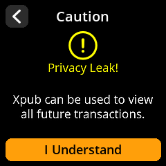</td></tr></table>
  <table align="left" style="border: 1px solid gray;"><tr><td align="center">SeedExportXpubDetailsView  </td></tr></table>
  <table align="left" style="border: 1px solid gray;"><tr><td align="center">SeedWordsWarningView  </td></tr></table>
  <table align="left" style="border: 1px solid gray;"><tr><td align="center">SeedWordsView  </td></tr></table>
  <table align="left" style="border: 1px solid gray;"><tr><td align="center">SeedWordsView_2  </td></tr></table>
  <table align="left" style="border: 1px solid gray;"><tr><td align="center">SeedBIP85ApplicationModeView  </td></tr></table>
  <table align="left" style="border: 1px solid gray;"><tr><td align="center">SeedBIP85SelectChildIndexView  </td></tr></table>
  <table align="left" style="border: 1px solid gray;"><tr><td align="center">SeedBIP85InvalidChildIndexView  </td></tr></table>
  <table align="left" style="border: 1px solid gray;"><tr><td align="center">SeedWordsBackupTestPromptView  </td></tr></table>
  <table align="left" style="border: 1px solid gray;"><tr><td align="center">SeedWordsBackupTestView  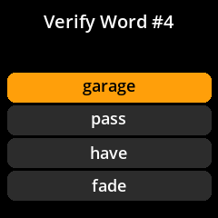</td></tr></table>
  <table align="left" style="border: 1px solid gray;"><tr><td align="center">SeedWordsBackupTestMistakeView  </td></tr></table>
  <table align="left" style="border: 1px solid gray;"><tr><td align="center">SeedWordsBackupTestSuccessView  </td></tr></table>
  <table align="left" style="border: 1px solid gray;"><tr><td align="center">SeedTranscribeSeedQRFormatView  </td></tr></table>
  <table align="left" style="border: 1px solid gray;"><tr><td align="center">SeedTranscribeSeedQRWarningView  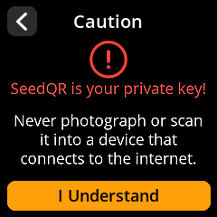</td></tr></table>
  <table align="left" style="border: 1px solid gray;"><tr><td align="center">SeedTranscribeSeedQRWholeQRView_12_Standard  </td></tr></table>
  <table align="left" style="border: 1px solid gray;"><tr><td align="center">SeedTranscribeSeedQRWholeQRView_12_Compact  </td></tr></table>
  <table align="left" style="border: 1px solid gray;"><tr><td align="center">SeedTranscribeSeedQRConfirmQRPromptView  </td></tr></table>
  <table align="left" style="border: 1px solid gray;"><tr><td align="center">LoadMultisigWalletDescriptorView  </td></tr></table>
  <table align="left" style="border: 1px solid gray;"><tr><td align="center">MultisigWalletDescriptorView  </td></tr></table>
  <table align="left" style="border: 1px solid gray;"><tr><td align="center">SeedDiscardView  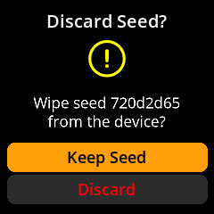</td></tr></table>
  <table align="left" style="border: 1px solid gray;"><tr><td align="center">SeedSignMessageConfirmMessageView  </td></tr></table>
  <table align="left" style="border: 1px solid gray;"><tr><td align="center">SeedSignMessageConfirmAddressView  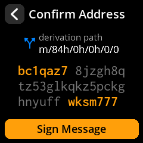</td></tr></table>
</td></tr></table>

---

## PSBT Views

<table style="border: 0;"><tr><td align="center">
  <table align="left" style="border: 1px solid gray;"><tr><td align="center">PSBTSelectSeedView  </td></tr></table>
  <table align="left" style="border: 1px solid gray;"><tr><td align="center">PSBTOverviewView  </td></tr></table>
  <table align="left" style="border: 1px solid gray;"><tr><td align="center">PSBTUnsupportedScriptTypeWarningView  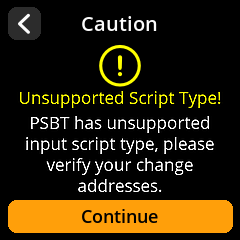</td></tr></table>
  <table align="left" style="border: 1px solid gray;"><tr><td align="center">PSBTNoChangeWarningView  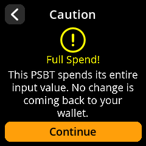</td></tr></table>
  <table align="left" style="border: 1px solid gray;"><tr><td align="center">PSBTMathView  </td></tr></table>
  <table align="left" style="border: 1px solid gray;"><tr><td align="center">PSBTAddressDetailsView  </td></tr></table>
  <table align="left" style="border: 1px solid gray;"><tr><td align="center">PSBTChangeDetailsView  </td></tr></table>
  <table align="left" style="border: 1px solid gray;"><tr><td align="center">PSBTAddressVerificationFailedView_singlesig_change  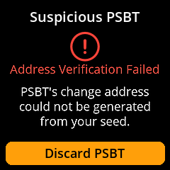</td></tr></table>
  <table align="left" style="border: 1px solid gray;"><tr><td align="center">PSBTAddressVerificationFailedView_singlesig_selftransfer  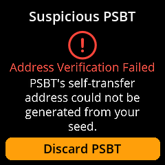</td></tr></table>
  <table align="left" style="border: 1px solid gray;"><tr><td align="center">PSBTAddressVerificationFailedView_multisig_change  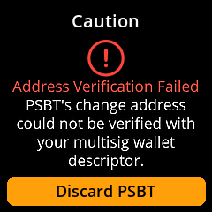</td></tr></table>
  <table align="left" style="border: 1px solid gray;"><tr><td align="center">PSBTAddressVerificationFailedView_multisig_selftransfer  </td></tr></table>
  <table align="left" style="border: 1px solid gray;"><tr><td align="center">PSBTFinalizeView  </td></tr></table>
  <table align="left" style="border: 1px solid gray;"><tr><td align="center">PSBTSigningErrorView  </td></tr></table>
</td></tr></table>

---

## Tools Views

<table style="border: 0;"><tr><td align="center">
  <table align="left" style="border: 1px solid gray;"><tr><td align="center">ToolsMenuView  </td></tr></table>
  <table align="left" style="border: 1px solid gray;"><tr><td align="center">ToolsImageEntropyMnemonicLengthView  </td></tr></table>
  <table align="left" style="border: 1px solid gray;"><tr><td align="center">ToolsDiceEntropyMnemonicLengthView  </td></tr></table>
  <table align="left" style="border: 1px solid gray;"><tr><td align="center">ToolsDiceEntropyEntryView  </td></tr></table>
  <table align="left" style="border: 1px solid gray;"><tr><td align="center">ToolsCalcFinalWordNumWordsView  </td></tr></table>
  <table align="left" style="border: 1px solid gray;"><tr><td align="center">ToolsCalcFinalWordFinalizePromptView  </td></tr></table>
  <table align="left" style="border: 1px solid gray;"><tr><td align="center">ToolsCalcFinalWordCoinFlipsView  </td></tr></table>
  <table align="left" style="border: 1px solid gray;"><tr><td align="center">ToolsCalcFinalWordShowFinalWordView_pick_word  </td></tr></table>
  <table align="left" style="border: 1px solid gray;"><tr><td align="center">ToolsCalcFinalWordShowFinalWordView_coin_flips  </td></tr></table>
  <table align="left" style="border: 1px solid gray;"><tr><td align="center">ToolsAddressExplorerSelectSourceView  </td></tr></table>
  <table align="left" style="border: 1px solid gray;"><tr><td align="center">ToolsAddressExplorerAddressTypeView  </td></tr></table>
  <table align="left" style="border: 1px solid gray;"><tr><td align="center">ToolsAddressExplorerAddressListView  </td></tr></table>
</td></tr></table>

---

## Settings Views

<table style="border: 0;"><tr><td align="center">
  <table align="left" style="border: 1px solid gray;"><tr><td align="center">SettingsMenuView  </td></tr></table>
  <table align="left" style="border: 1px solid gray;"><tr><td align="center">SettingsEntryUpdateSelectionView_persistent_settings  </td></tr></table>
  <table align="left" style="border: 1px solid gray;"><tr><td align="center">SettingsEntryUpdateSelectionView_coordinators  </td></tr></table>
  <table align="left" style="border: 1px solid gray;"><tr><td align="center">SettingsEntryUpdateSelectionView_denomination  </td></tr></table>
  <table align="left" style="border: 1px solid gray;"><tr><td align="center">SettingsEntryUpdateSelectionView_network  </td></tr></table>
  <table align="left" style="border: 1px solid gray;"><tr><td align="center">SettingsEntryUpdateSelectionView_qr_density  </td></tr></table>
  <table align="left" style="border: 1px solid gray;"><tr><td align="center">SettingsEntryUpdateSelectionView_xpub_export  </td></tr></table>
  <table align="left" style="border: 1px solid gray;"><tr><td align="center">SettingsEntryUpdateSelectionView_sig_types  </td></tr></table>
  <table align="left" style="border: 1px solid gray;"><tr><td align="center">SettingsEntryUpdateSelectionView_script_types  </td></tr></table>
  <table align="left" style="border: 1px solid gray;"><tr><td align="center">SettingsEntryUpdateSelectionView_xpub_details  </td></tr></table>
  <table align="left" style="border: 1px solid gray;"><tr><td align="center">SettingsEntryUpdateSelectionView_passphrase  </td></tr></table>
  <table align="left" style="border: 1px solid gray;"><tr><td align="center">SettingsEntryUpdateSelectionView_camera_rotation  </td></tr></table>
  <table align="left" style="border: 1px solid gray;"><tr><td align="center">SettingsEntryUpdateSelectionView_compact_seedqr  </td></tr></table>
  <table align="left" style="border: 1px solid gray;"><tr><td align="center">SettingsEntryUpdateSelectionView_bip85_child_seeds  </td></tr></table>
  <table align="left" style="border: 1px solid gray;"><tr><td align="center">SettingsEntryUpdateSelectionView_message_signing  </td></tr></table>
  <table align="left" style="border: 1px solid gray;"><tr><td align="center">SettingsEntryUpdateSelectionView_privacy_warnings  </td></tr></table>
  <table align="left" style="border: 1px solid gray;"><tr><td align="center">SettingsEntryUpdateSelectionView_dire_warnings  </td></tr></table>
  <table align="left" style="border: 1px solid gray;"><tr><td align="center">SettingsEntryUpdateSelectionView_qr_brightness_tips  </td></tr></table>
  <table align="left" style="border: 1px solid gray;"><tr><td align="center">SettingsEntryUpdateSelectionView_partner_logos  </td></tr></table>
  <table align="left" style="border: 1px solid gray;"><tr><td align="center">IOTestView  </td></tr></table>
  <table align="left" style="border: 1px solid gray;"><tr><td align="center">DonateView  </td></tr></table>
</td></tr></table>