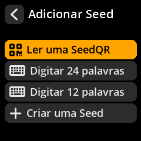
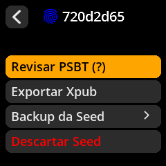
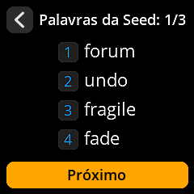
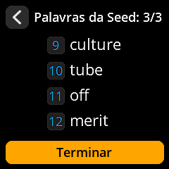
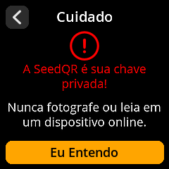
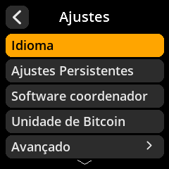

# SeedSigner Screenshots: Portuguese
## Translation progress: 98.3%

---

<table align="left" style="border: 1px solid gray;"><tr><td align="center">MainMenuView  </td></tr></table><table align="left" style="border: 1px solid gray;"><tr><td align="center">PowerOffView  </td></tr></table><table align="left" style="border: 1px solid gray;"><tr><td align="center">SettingsUpdatedView  </td></tr></table><table align="left" style="border: 1px solid gray;"><tr><td align="center">LoadSeedView  </td></tr></table><table align="left" style="border: 1px solid gray;"><tr><td align="center">SeedMnemonicEntryView  </td></tr></table><table align="left" style="border: 1px solid gray;"><tr><td align="center">SeedMnemonicInvalidView  </td></tr></table><table align="left" style="border: 1px solid gray;"><tr><td align="center">SeedOptionsView  </td></tr></table><table align="left" style="border: 1px solid gray;"><tr><td align="center">SeedBackupView  </td></tr></table><table align="left" style="border: 1px solid gray;"><tr><td align="center">SeedWordsWarningView  </td></tr></table><table align="left" style="border: 1px solid gray;"><tr><td align="center">SeedWordsView  </td></tr></table><table align="left" style="border: 1px solid gray;"><tr><td align="center">SeedWordsView_2  </td></tr></table><table align="left" style="border: 1px solid gray;"><tr><td align="center">SeedTranscribeSeedQRFormatView  </td></tr></table><table align="left" style="border: 1px solid gray;"><tr><td align="center">SeedTranscribeSeedQRWarningView  </td></tr></table><table align="left" style="border: 1px solid gray;"><tr><td align="center">SeedTranscribeSeedQRWholeQRView_12_Standard  </td></tr></table><table align="left" style="border: 1px solid gray;"><tr><td align="center">SeedTranscribeSeedQRWholeQRView_12_Compact  </td></tr></table><table align="left" style="border: 1px solid gray;"><tr><td align="center">SeedTranscribeSeedQRConfirmQRPromptView  </td></tr></table><table align="left" style="border: 1px solid gray;"><tr><td align="center">SeedTranscribeSeedQRConfirmScanView  </td></tr></table><table align="left" style="border: 1px solid gray;"><tr><td align="center">SettingsMenuView  </td></tr></table><table align="left" style="border: 1px solid gray;"><tr><td align="center">SettingsEntryUpdateSelectionView  </td></tr></table><table align="left" style="border: 1px solid gray;"><tr><td align="center">IOTestView  </td></tr></table><table align="left" style="border: 1px solid gray;"><tr><td align="center">DonateView  </td></tr></table><table align="left" style="border: 1px solid gray;"><tr><td align="center">ToolsMenuView  </td></tr></table><table align="left" style="border: 1px solid gray;"><tr><td align="center">ToolsDiceEntropyMnemonicLengthView  </td></tr></table><table align="left" style="border: 1px solid gray;"><tr><td align="center">ToolsDiceEntropyEntryView  </td></tr></table>