# SeedSigner Screenshots: (incomplete) русский (Russian)
## Translation progress: 79.7%

---

---

## Main Menu Views

<table style="border: 0;"><tr><td align="center">  <table align="left" style="border: 1px solid gray;"><tr><td align="center">OpeningSplashView  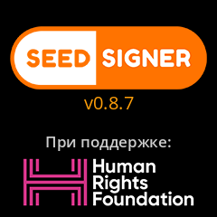</td></tr></table>
  <table align="left" style="border: 1px solid gray;"><tr><td align="center">OpeningSplashView_no_partner_logos  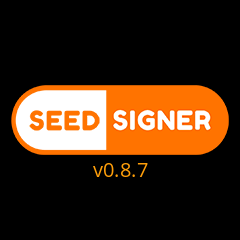</td></tr></table>
  <table align="left" style="border: 1px solid gray;"><tr><td align="center">MainMenuView  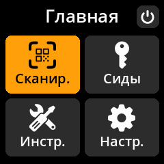</td></tr></table>
  <table align="left" style="border: 1px solid gray;"><tr><td align="center">MainMenuView_SDCardStateChangeToast_removed  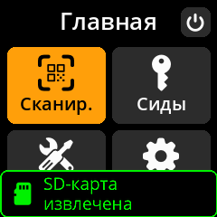</td></tr></table>
  <table align="left" style="border: 1px solid gray;"><tr><td align="center">MainMenuView_SDCardStateChangeToast_inserted  </td></tr></table>
  <table align="left" style="border: 1px solid gray;"><tr><td align="center">MainMenuView_RemoveSDCardToast  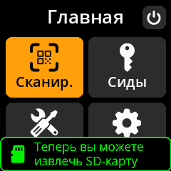</td></tr></table>
  <table align="left" style="border: 1px solid gray;"><tr><td align="center">RemoveMicroSDWarningView  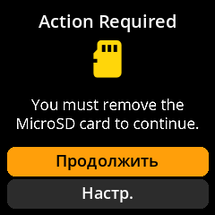</td></tr></table>
  <table align="left" style="border: 1px solid gray;"><tr><td align="center">MainMenuView_DefaultToast  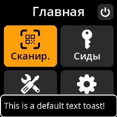</td></tr></table>
  <table align="left" style="border: 1px solid gray;"><tr><td align="center">MainMenuView_InfoToast  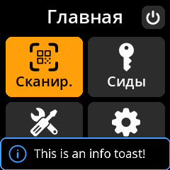</td></tr></table>
  <table align="left" style="border: 1px solid gray;"><tr><td align="center">MainMenuView_SuccessToast  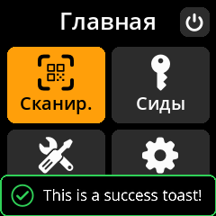</td></tr></table>
  <table align="left" style="border: 1px solid gray;"><tr><td align="center">MainMenuView_WarningToast  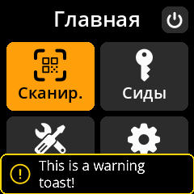</td></tr></table>
  <table align="left" style="border: 1px solid gray;"><tr><td align="center">MainMenuView_DireWarningToast  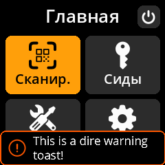</td></tr></table>
  <table align="left" style="border: 1px solid gray;"><tr><td align="center">MainMenuView_ErrorToast  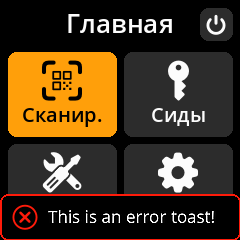</td></tr></table>
  <table align="left" style="border: 1px solid gray;"><tr><td align="center">PowerOptionsView  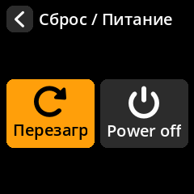</td></tr></table>
  <table align="left" style="border: 1px solid gray;"><tr><td align="center">RestartView  </td></tr></table>
  <table align="left" style="border: 1px solid gray;"><tr><td align="center">PowerOffView  </td></tr></table>
</td></tr></table>

---

## Seed Views

<table style="border: 0;"><tr><td align="center">  <table align="left" style="border: 1px solid gray;"><tr><td align="center">SeedsMenuView  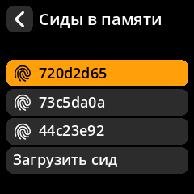</td></tr></table>
  <table align="left" style="border: 1px solid gray;"><tr><td align="center">LoadSeedView  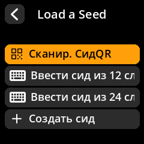</td></tr></table>
  <table align="left" style="border: 1px solid gray;"><tr><td align="center">SeedMnemonicEntryView  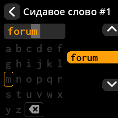</td></tr></table>
  <table align="left" style="border: 1px solid gray;"><tr><td align="center">SeedMnemonicInvalidView  </td></tr></table>
  <table align="left" style="border: 1px solid gray;"><tr><td align="center">SeedFinalizeView  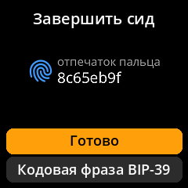</td></tr></table>
  <table align="left" style="border: 1px solid gray;"><tr><td align="center">SeedAddPassphraseView_lowercase  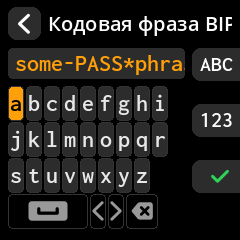</td></tr></table>
  <table align="left" style="border: 1px solid gray;"><tr><td align="center">SeedAddPassphraseView_uppercase  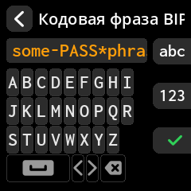</td></tr></table>
  <table align="left" style="border: 1px solid gray;"><tr><td align="center">SeedAddPassphraseView_digits  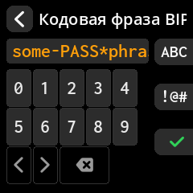</td></tr></table>
  <table align="left" style="border: 1px solid gray;"><tr><td align="center">SeedAddPassphraseView_symbols_1  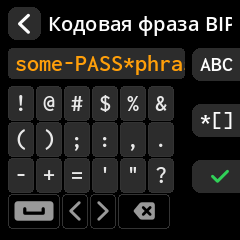</td></tr></table>
  <table align="left" style="border: 1px solid gray;"><tr><td align="center">SeedAddPassphraseView_symbols_2  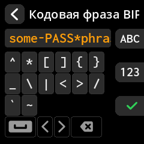</td></tr></table>
  <table align="left" style="border: 1px solid gray;"><tr><td align="center">SeedAddPassphraseExitDialogView  </td></tr></table>
  <table align="left" style="border: 1px solid gray;"><tr><td align="center">SeedReviewPassphraseView  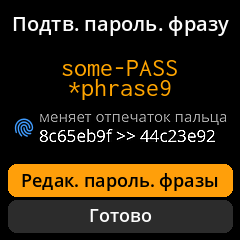</td></tr></table>
  <table align="left" style="border: 1px solid gray;"><tr><td align="center">SeedOptionsView  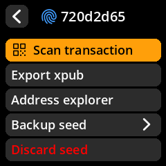</td></tr></table>
  <table align="left" style="border: 1px solid gray;"><tr><td align="center">SeedBackupView  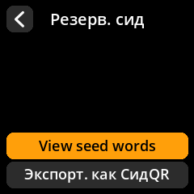</td></tr></table>
  <table align="left" style="border: 1px solid gray;"><tr><td align="center">SeedExportXpubSigTypeView  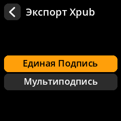</td></tr></table>
  <table align="left" style="border: 1px solid gray;"><tr><td align="center">SeedExportXpubScriptTypeView  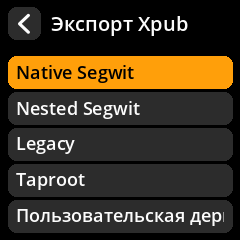</td></tr></table>
  <table align="left" style="border: 1px solid gray;"><tr><td align="center">SeedExportXpubCustomDerivationView  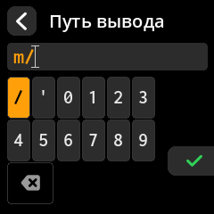</td></tr></table>
  <table align="left" style="border: 1px solid gray;"><tr><td align="center">SeedExportXpubQRFormatView  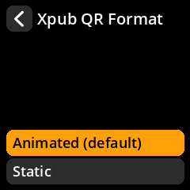</td></tr></table>
  <table align="left" style="border: 1px solid gray;"><tr><td align="center">SeedExportXpubWarningView  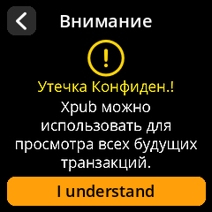</td></tr></table>
  <table align="left" style="border: 1px solid gray;"><tr><td align="center">SeedExportXpubDetailsView  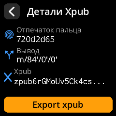</td></tr></table>
  <table align="left" style="border: 1px solid gray;"><tr><td align="center">SeedExportXpubQR_ScreenBrightnessView  </td></tr></table>
  <table align="left" style="border: 1px solid gray;"><tr><td align="center">SeedWordsWarningView  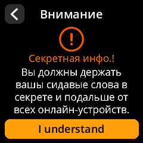</td></tr></table>
  <table align="left" style="border: 1px solid gray;"><tr><td align="center">SeedWordsView  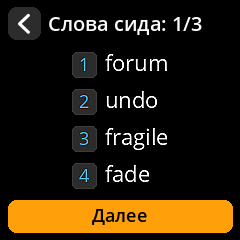</td></tr></table>
  <table align="left" style="border: 1px solid gray;"><tr><td align="center">SeedWordsView_2  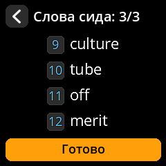</td></tr></table>
  <table align="left" style="border: 1px solid gray;"><tr><td align="center">SeedBIP85SelectNumWordsView  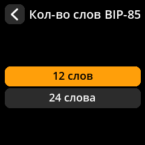</td></tr></table>
  <table align="left" style="border: 1px solid gray;"><tr><td align="center">SeedBIP85SelectChildIndexView  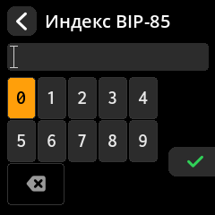</td></tr></table>
  <table align="left" style="border: 1px solid gray;"><tr><td align="center">SeedBIP85InvalidChildIndexView  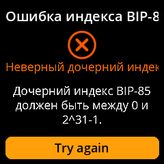</td></tr></table>
  <table align="left" style="border: 1px solid gray;"><tr><td align="center">SeedWordsBackupTestPromptView  </td></tr></table>
  <table align="left" style="border: 1px solid gray;"><tr><td align="center">SeedWordsBackupTestView  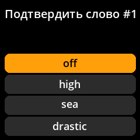</td></tr></table>
  <table align="left" style="border: 1px solid gray;"><tr><td align="center">SeedWordsBackupTestMistakeView  </td></tr></table>
  <table align="left" style="border: 1px solid gray;"><tr><td align="center">SeedWordsBackupTestSuccessView  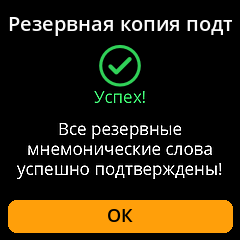</td></tr></table>
  <table align="left" style="border: 1px solid gray;"><tr><td align="center">SeedTranscribeSeedQRFormatView  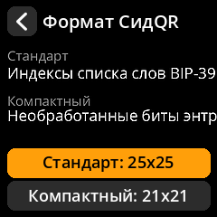</td></tr></table>
  <table align="left" style="border: 1px solid gray;"><tr><td align="center">SeedTranscribeSeedQRWarningView  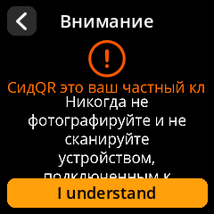</td></tr></table>
  <table align="left" style="border: 1px solid gray;"><tr><td align="center">SeedTranscribeSeedQRWholeQRView_12_Compact  </td></tr></table>
  <table align="left" style="border: 1px solid gray;"><tr><td align="center">SeedTranscribeSeedQRWholeQRView_12_Standard  </td></tr></table>
  <table align="left" style="border: 1px solid gray;"><tr><td align="center">SeedTranscribeSeedQRWholeQRView_24_Compact  </td></tr></table>
  <table align="left" style="border: 1px solid gray;"><tr><td align="center">SeedTranscribeSeedQRWholeQRView_24_Standard  </td></tr></table>
  <table align="left" style="border: 1px solid gray;"><tr><td align="center">SeedTranscribeSeedQRZoomedInView_12_Compact  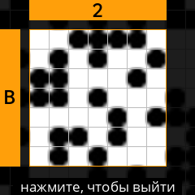</td></tr></table>
  <table align="left" style="border: 1px solid gray;"><tr><td align="center">SeedTranscribeSeedQRZoomedInView_12_Standard  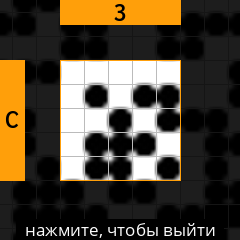</td></tr></table>
  <table align="left" style="border: 1px solid gray;"><tr><td align="center">SeedTranscribeSeedQRConfirmQRPromptView  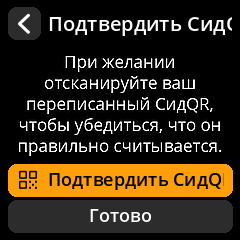</td></tr></table>
  <table align="left" style="border: 1px solid gray;"><tr><td align="center">SeedTranscribeSeedQRConfirmWrongSeedView  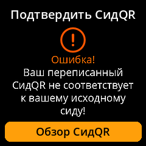</td></tr></table>
  <table align="left" style="border: 1px solid gray;"><tr><td align="center">SeedTranscribeSeedQRConfirmInvalidQRView  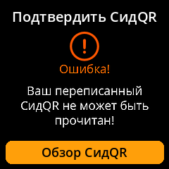</td></tr></table>
  <table align="left" style="border: 1px solid gray;"><tr><td align="center">SeedTranscribeSeedQRConfirmSuccessView  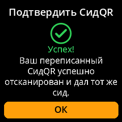</td></tr></table>
  <table align="left" style="border: 1px solid gray;"><tr><td align="center">SeedSelectSeedView_address_verification  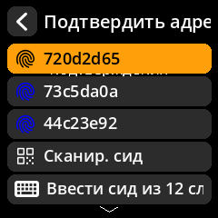</td></tr></table>
  <table align="left" style="border: 1px solid gray;"><tr><td align="center">AddressVerificationSigTypeView  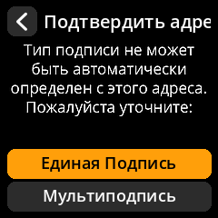</td></tr></table>
  <table align="left" style="border: 1px solid gray;"><tr><td align="center">SeedAddressVerificationView  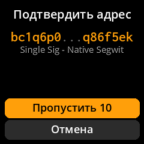</td></tr></table>
  <table align="left" style="border: 1px solid gray;"><tr><td align="center">SeedAddressVerificationSuccessView  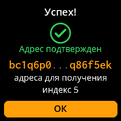</td></tr></table>
  <table align="left" style="border: 1px solid gray;"><tr><td align="center">LoadMultisigWalletDescriptorView  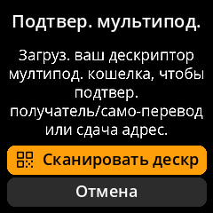</td></tr></table>
  <table align="left" style="border: 1px solid gray;"><tr><td align="center">MultisigWalletDescriptorView  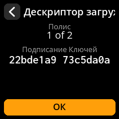</td></tr></table>
  <table align="left" style="border: 1px solid gray;"><tr><td align="center">SeedDiscardView  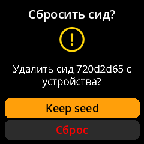</td></tr></table>
  <table align="left" style="border: 1px solid gray;"><tr><td align="center">SeedSelectSeedView_sign_message  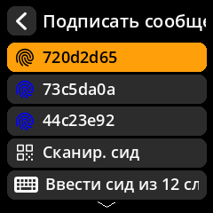</td></tr></table>
  <table align="left" style="border: 1px solid gray;"><tr><td align="center">SeedSignMessageConfirmMessageView  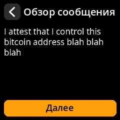</td></tr></table>
  <table align="left" style="border: 1px solid gray;"><tr><td align="center">SeedSignMessageConfirmAddressView  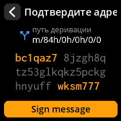</td></tr></table>
  <table align="left" style="border: 1px solid gray;"><tr><td align="center">SeedElectrumMnemonicStartView  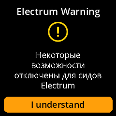</td></tr></table>
</td></tr></table>

---

## PSBT Views

<table style="border: 0;"><tr><td align="center">  <table align="left" style="border: 1px solid gray;"><tr><td align="center">PSBTSelectSeedView  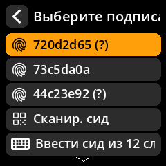</td></tr></table>
  <table align="left" style="border: 1px solid gray;"><tr><td align="center">PSBTOverviewView  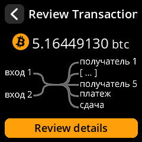</td></tr></table>
  <table align="left" style="border: 1px solid gray;"><tr><td align="center">PSBTUnsupportedScriptTypeWarningView  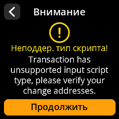</td></tr></table>
  <table align="left" style="border: 1px solid gray;"><tr><td align="center">PSBTNoChangeWarningView  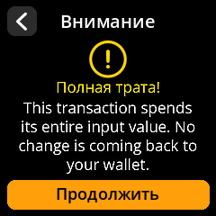</td></tr></table>
  <table align="left" style="border: 1px solid gray;"><tr><td align="center">PSBTMathView  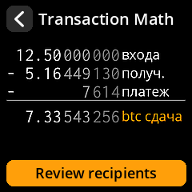</td></tr></table>
  <table align="left" style="border: 1px solid gray;"><tr><td align="center">PSBTAddressDetailsView  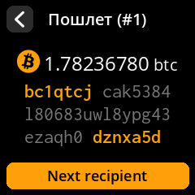</td></tr></table>
  <table align="left" style="border: 1px solid gray;"><tr><td align="center">PSBTChangeDetailsView_single_sig_change_verified  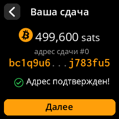</td></tr></table>
  <table align="left" style="border: 1px solid gray;"><tr><td align="center">PSBTChangeDetailsView_single_sig_self_transfer_verified  </td></tr></table>
  <table align="left" style="border: 1px solid gray;"><tr><td align="center">PSBTChangeDetailsView_multisig_unverified  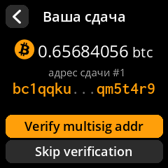</td></tr></table>
  <table align="left" style="border: 1px solid gray;"><tr><td align="center">PSBTChangeDetailsView_multisig_verified  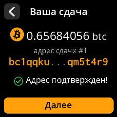</td></tr></table>
  <table align="left" style="border: 1px solid gray;"><tr><td align="center">PSBTOverviewView_op_return  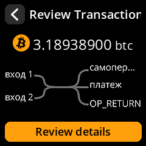</td></tr></table>
  <table align="left" style="border: 1px solid gray;"><tr><td align="center">PSBTOpReturnView_text  </td></tr></table>
  <table align="left" style="border: 1px solid gray;"><tr><td align="center">PSBTOpReturnView_raw_hex_data  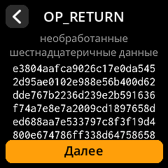</td></tr></table>
  <table align="left" style="border: 1px solid gray;"><tr><td align="center">PSBTAddressVerificationFailedView_singlesig_change  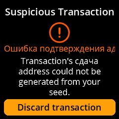</td></tr></table>
  <table align="left" style="border: 1px solid gray;"><tr><td align="center">PSBTAddressVerificationFailedView_singlesig_selftransfer  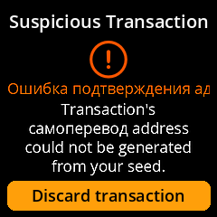</td></tr></table>
  <table align="left" style="border: 1px solid gray;"><tr><td align="center">PSBTAddressVerificationFailedView_multisig_change  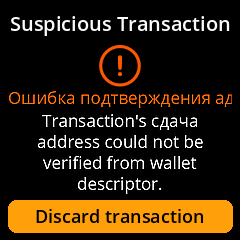</td></tr></table>
  <table align="left" style="border: 1px solid gray;"><tr><td align="center">PSBTAddressVerificationFailedView_multisig_selftransfer  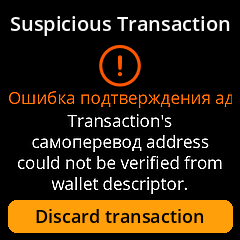</td></tr></table>
  <table align="left" style="border: 1px solid gray;"><tr><td align="center">PSBTFinalizeView  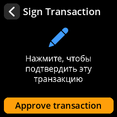</td></tr></table>
  <table align="left" style="border: 1px solid gray;"><tr><td align="center">PSBTSigningErrorView  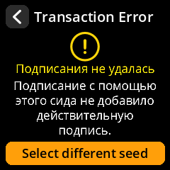</td></tr></table>
</td></tr></table>

---

## Tools Views

<table style="border: 0;"><tr><td align="center">  <table align="left" style="border: 1px solid gray;"><tr><td align="center">ToolsMenuView  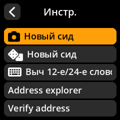</td></tr></table>
  <table align="left" style="border: 1px solid gray;"><tr><td align="center">ToolsImageEntropyMnemonicLengthView  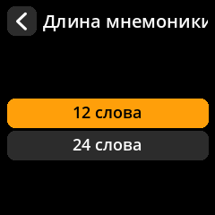</td></tr></table>
  <table align="left" style="border: 1px solid gray;"><tr><td align="center">ToolsDiceEntropyMnemonicLengthView  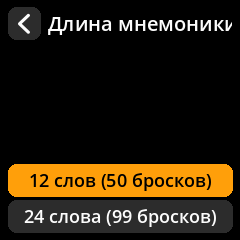</td></tr></table>
  <table align="left" style="border: 1px solid gray;"><tr><td align="center">ToolsDiceEntropyEntryView  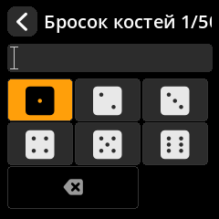</td></tr></table>
  <table align="left" style="border: 1px solid gray;"><tr><td align="center">ToolsCalcFinalWordNumWordsView  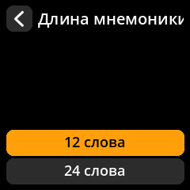</td></tr></table>
  <table align="left" style="border: 1px solid gray;"><tr><td align="center">ToolsCalcFinalWordFinalizePromptView  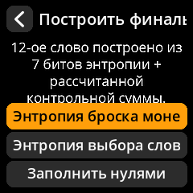</td></tr></table>
  <table align="left" style="border: 1px solid gray;"><tr><td align="center">ToolsCalcFinalWordCoinFlipsView  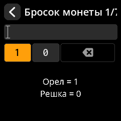</td></tr></table>
  <table align="left" style="border: 1px solid gray;"><tr><td align="center">ToolsCalcFinalWordShowFinalWordView_pick_word  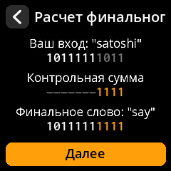</td></tr></table>
  <table align="left" style="border: 1px solid gray;"><tr><td align="center">ToolsCalcFinalWordShowFinalWordView_coin_flips  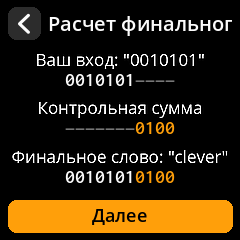</td></tr></table>
  <table align="left" style="border: 1px solid gray;"><tr><td align="center">ToolsCalcFinalWordDoneView  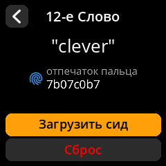</td></tr></table>
  <table align="left" style="border: 1px solid gray;"><tr><td align="center">ToolsAddressExplorerSelectSourceView  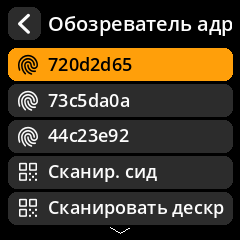</td></tr></table>
  <table align="left" style="border: 1px solid gray;"><tr><td align="center">ToolsAddressExplorerAddressTypeView  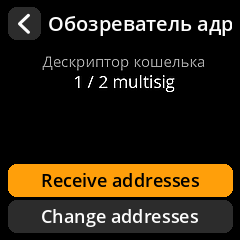</td></tr></table>
  <table align="left" style="border: 1px solid gray;"><tr><td align="center">ToolsAddressExplorerAddressListView  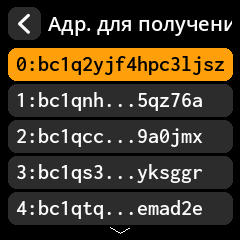</td></tr></table>
</td></tr></table>

---

## Settings Views

<table style="border: 0;"><tr><td align="center">  <table align="left" style="border: 1px solid gray;"><tr><td align="center">SettingsMenuView  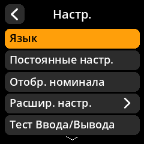</td></tr></table>
  <table align="left" style="border: 1px solid gray;"><tr><td align="center">LocaleSelectionView  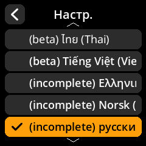</td></tr></table>
  <table align="left" style="border: 1px solid gray;"><tr><td align="center">SettingsEntryUpdateSelectionView_persistent_settings  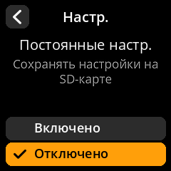</td></tr></table>
  <table align="left" style="border: 1px solid gray;"><tr><td align="center">SettingsEntryUpdateSelectionView_denomination  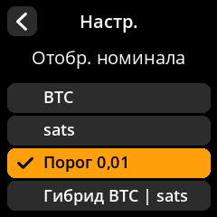</td></tr></table>
  <table align="left" style="border: 1px solid gray;"><tr><td align="center">SettingsMenuView__Advanced  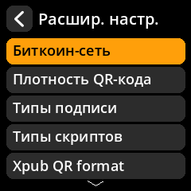</td></tr></table>
  <table align="left" style="border: 1px solid gray;"><tr><td align="center">SettingsEntryUpdateSelectionView_network  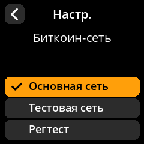</td></tr></table>
  <table align="left" style="border: 1px solid gray;"><tr><td align="center">SettingsEntryUpdateSelectionView_qr_density  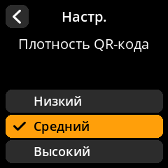</td></tr></table>
  <table align="left" style="border: 1px solid gray;"><tr><td align="center">SettingsEntryUpdateSelectionView_sig_types  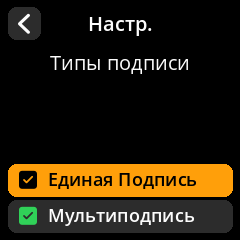</td></tr></table>
  <table align="left" style="border: 1px solid gray;"><tr><td align="center">SettingsEntryUpdateSelectionView_script_types  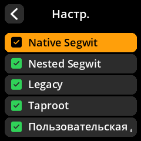</td></tr></table>
  <table align="left" style="border: 1px solid gray;"><tr><td align="center">SettingsEntryUpdateSelectionView_xpub_qr  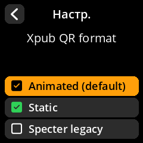</td></tr></table>
  <table align="left" style="border: 1px solid gray;"><tr><td align="center">SettingsEntryUpdateSelectionView_xpub_details  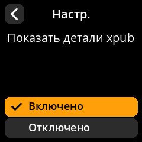</td></tr></table>
  <table align="left" style="border: 1px solid gray;"><tr><td align="center">SettingsEntryUpdateSelectionView_passphrase  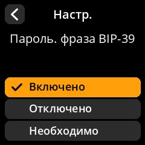</td></tr></table>
  <table align="left" style="border: 1px solid gray;"><tr><td align="center">SettingsEntryUpdateSelectionView_camera_rotation  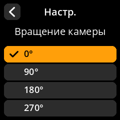</td></tr></table>
  <table align="left" style="border: 1px solid gray;"><tr><td align="center">SettingsEntryUpdateSelectionView_compact_seedqr  </td></tr></table>
  <table align="left" style="border: 1px solid gray;"><tr><td align="center">SettingsEntryUpdateSelectionView_bip85_child_seeds  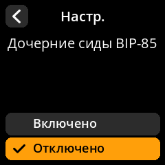</td></tr></table>
  <table align="left" style="border: 1px solid gray;"><tr><td align="center">SettingsEntryUpdateSelectionView_electrum_seeds  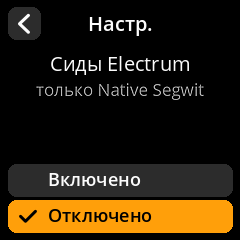</td></tr></table>
  <table align="left" style="border: 1px solid gray;"><tr><td align="center">SettingsEntryUpdateSelectionView_microsd_toast_timer  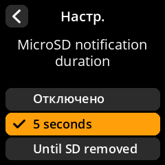</td></tr></table>
  <table align="left" style="border: 1px solid gray;"><tr><td align="center">SettingsEntryUpdateSelectionView_message_signing  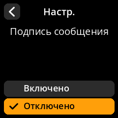</td></tr></table>
  <table align="left" style="border: 1px solid gray;"><tr><td align="center">SettingsEntryUpdateSelectionView_privacy_warnings  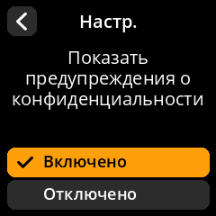</td></tr></table>
  <table align="left" style="border: 1px solid gray;"><tr><td align="center">SettingsEntryUpdateSelectionView_dire_warnings  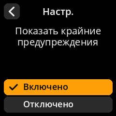</td></tr></table>
  <table align="left" style="border: 1px solid gray;"><tr><td align="center">SettingsEntryUpdateSelectionView_qr_brightness_tips  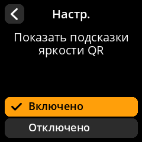</td></tr></table>
  <table align="left" style="border: 1px solid gray;"><tr><td align="center">SettingsEntryUpdateSelectionView_partner_logos  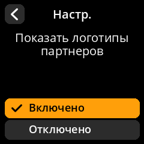</td></tr></table>
  <table align="left" style="border: 1px solid gray;"><tr><td align="center">SettingsMenuView__Hardware  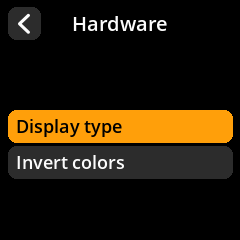</td></tr></table>
  <table align="left" style="border: 1px solid gray;"><tr><td align="center">SettingsEntryUpdateSelectionView_display_config  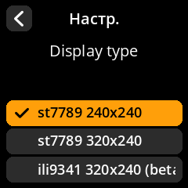</td></tr></table>
  <table align="left" style="border: 1px solid gray;"><tr><td align="center">SettingsEntryUpdateSelectionView_color_inverted  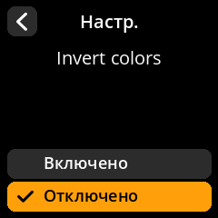</td></tr></table>
  <table align="left" style="border: 1px solid gray;"><tr><td align="center">IOTestView  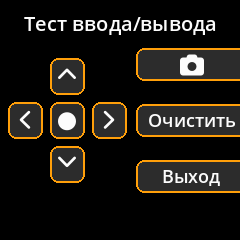</td></tr></table>
  <table align="left" style="border: 1px solid gray;"><tr><td align="center">DonateView  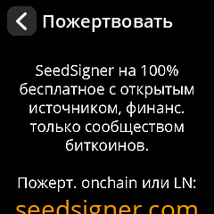</td></tr></table>
  <table align="left" style="border: 1px solid gray;"><tr><td align="center">SettingsIngestSettingsQRView_persistent  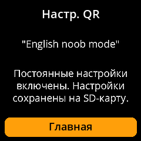</td></tr></table>
  <table align="left" style="border: 1px solid gray;"><tr><td align="center">SettingsIngestSettingsQRView_not_persistent  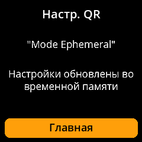</td></tr></table>
  <table align="left" style="border: 1px solid gray;"><tr><td align="center">SettingsSelectionRequiredWarningView  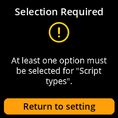</td></tr></table>
</td></tr></table>

---

## Misc Error Views

<table style="border: 0;"><tr><td align="center">  <table align="left" style="border: 1px solid gray;"><tr><td align="center">NotYetImplementedView  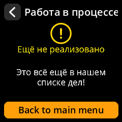</td></tr></table>
  <table align="left" style="border: 1px solid gray;"><tr><td align="center">UnhandledExceptionView  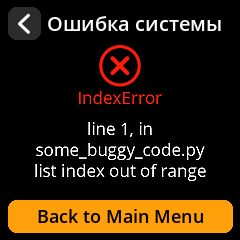</td></tr></table>
  <table align="left" style="border: 1px solid gray;"><tr><td align="center">CameraConnectionErrorView  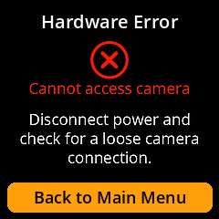</td></tr></table>
  <table align="left" style="border: 1px solid gray;"><tr><td align="center">NetworkMismatchErrorView  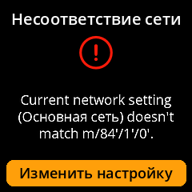</td></tr></table>
  <table align="left" style="border: 1px solid gray;"><tr><td align="center">OptionDisabledView  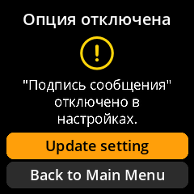</td></tr></table>
  <table align="left" style="border: 1px solid gray;"><tr><td align="center">ScanInvalidQRTypeView  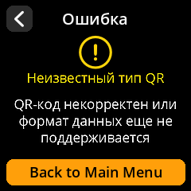</td></tr></table>
</td></tr></table>