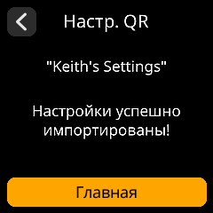
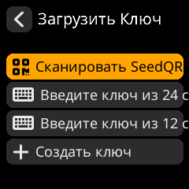
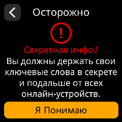
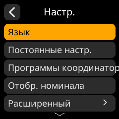
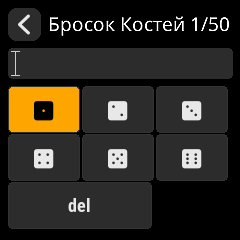

# SeedSigner Screenshots: Russian
## Translation progress: 11.9%

---

<table align="left" style="border: 1px solid gray;"><tr><td align="center">MainMenuView</td></tr><tr><td align="center"></td></tr></table><table align="left" style="border: 1px solid gray;"><tr><td align="center">PowerOffView</td></tr><tr><td align="center"></td></tr></table><table align="left" style="border: 1px solid gray;"><tr><td align="center">SettingsUpdatedView</td></tr><tr><td align="center"></td></tr></table><table align="left" style="border: 1px solid gray;"><tr><td align="center">LoadSeedView</td></tr><tr><td align="center"></td></tr></table><table align="left" style="border: 1px solid gray;"><tr><td align="center">SeedMnemonicEntryView</td></tr><tr><td align="center"></td></tr></table><table align="left" style="border: 1px solid gray;"><tr><td align="center">SeedMnemonicInvalidView</td></tr><tr><td align="center"></td></tr></table><table align="left" style="border: 1px solid gray;"><tr><td align="center">SeedWordsWarningView</td></tr><tr><td align="center"></td></tr></table><table align="left" style="border: 1px solid gray;"><tr><td align="center">SettingsMenuView</td></tr><tr><td align="center"></td></tr></table><table align="left" style="border: 1px solid gray;"><tr><td align="center">SettingsEntryUpdateSelectionView</td></tr><tr><td align="center"></td></tr></table><table align="left" style="border: 1px solid gray;"><tr><td align="center">IOTestView</td></tr><tr><td align="center"></td></tr></table><table align="left" style="border: 1px solid gray;"><tr><td align="center">DonateView</td></tr><tr><td align="center"></td></tr></table><table align="left" style="border: 1px solid gray;"><tr><td align="center">ToolsMenuView</td></tr><tr><td align="center"></td></tr></table><table align="left" style="border: 1px solid gray;"><tr><td align="center">ToolsDiceEntropyMnemonicLengthView</td></tr><tr><td align="center"></td></tr></table><table align="left" style="border: 1px solid gray;"><tr><td align="center">ToolsDiceEntropyEntryView</td></tr><tr><td align="center"></td></tr></table>